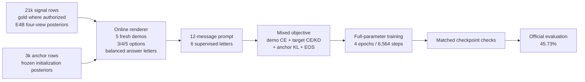

# Zagreus ITALIC 45.73

Zagreus is a compact, 437.8M-unique-parameter causal language model trained for
Italian multiple-choice reasoning. The promoted checkpoint scored **45.73%** on
the 10,000-question official ITALIC evaluation.

**[Download the model on Hugging Face](https://huggingface.co/mcsp/zagreus-italic-45.73)**
· **[View the latest release](https://github.com/LudWittg/zagreus-italic-45.73/releases/latest)**

## Result at a glance

| Model stage | Main change | Official accuracy | Gain |
|---|---|---:|---:|
| ARM-A | Earlier single-question recipe | 39.04% | — |
| ARM-F | Training prompts matched to the official five-shot format | 41.76% | +2.72 pp |
| **Zagreus 45.73** | Online demonstrations, online option permutation, longer schedule | **45.73%** | **+3.97 pp** |

The final model improves ARM-A by **6.69 percentage points**. Its official
interface metrics were:

| Rows | Accuracy | Valid answers | Exact one-character outputs | Mean output length |
|---:|---:|---:|---:|---:|
| 10,000 | **45.73%** | 99.97% | 99.95% | 1.0 character |

Evaluated weight SHA-256:

```text
0c0a42e642e009d6aff7dd6663707ee0f877218b826ffb1d4ab3abd46687a991
```

The run used the unmodified official harness at ITALIC commit
`92df420ff686babeea54e217b9f90f8471374916`, deterministic decoding, and the
official five-shot conversational interface. The tracked harness tree matched
its pre-run snapshot after evaluation. No ITALIC example entered training,
labeling, demonstration sampling, or checkpoint selection.

## Why the training format matters

The official input is not a single multiple-choice question. It is a
12-message conversation:

```text
system instruction
  → 5 × (demonstration question → demonstration answer letter)
  → target question
  → model completes the target answer letter
```

Earlier checkpoints had been trained on isolated, four-option questions even
though the benchmark also contains three- and five-option items. ARM-F fixed
the conversation format and gained 2.72 official points. The final run kept
that format but stopped treating each training row as one frozen sequence:
demonstrations, option counts, option order, and target view were generated
again online throughout training.

## Training pipeline



### 1. Two training streams

The effective epoch mixes two kinds of examples:

- **21,000 signal rows (80%)** provide task learning. Every row has a
  four-view probability distribution from the retained
  `google/gemma-4-E4B-it` control teacher. A vetted subset of 9,713 rows also
  has an authorized hard gold label.
- **3,000 unique anchor rows**, resampled to **20% of epoch exposures**, constrain
  the model to stay close to the ARM-F initialization. Anchoring reduces
  destructive drift while the model sees a much larger set of online-rendered
  sequences.

The three-teacher Mistral/Gemma/Qwen ensemble was tested in the preceding
campaign, but its student arm did not beat the simpler E4B-control recipe. The
winning lineage therefore deliberately retains the E4B posterior signal rather
than claiming an ensemble gain that did not transfer.

### 2. Online, benchmark-shaped rendering

For every target exposure, the renderer deterministically derives fresh choices
from `(seed, epoch, serial number, row id)`:

1. Sample one of four teacher views.
2. Sample a 3-, 4-, or 5-option layout using the benchmark's public aggregate
   option-count profile.
3. For a three-option item, remove a non-protected distractor; the gold and
   teacher top choice cannot be dropped.
4. For a five-option item, add a non-duplicate distractor from a different
   training group.
5. Permute semantic options into display slots while balancing displayed
   answer letters separately for each option count.
6. Sample five demonstrations from gold-authorized training rows. Demonstration
   groups cannot overlap each other or the target group.

This means repeated epochs do not replay identical prompts. The underlying
question pool stays fixed, but the effective sequence distribution is
combinatorially larger.

### 3. Six supervised assistant turns

Each sequence supervises the five demonstration letters and the final target
letter. This matters because five-shot prompts are much longer than the old
single-question format: supervising six positions recovers useful learning
signal from that sequence length instead of training only on the final token.

The model also learns to emit EOS immediately after the target letter. At
inference time the expected completion is therefore one answer letter, not a
rationale.

### 4. The objective

For a signal row, let:

- `L_demo` be mean cross-entropy across the five demonstration letters;
- `L_KD` be KL divergence from the E4B semantic-option distribution at
  temperature `T=2`, multiplied by `T²`;
- `L_CE` be target gold cross-entropy when a vetted gold label is available;
- `L_EOS` be cross-entropy for immediate end-of-sequence.

The target term is:

```text
L_target = 0.5 L_CE + 0.5 L_KD    when gold is authorized
L_target = L_KD                    otherwise
```

and the complete signal loss is:

```text
L_signal = (5 L_demo + L_target) / 6 + 0.1 L_EOS
```

The five-to-one weighting is not an arbitrary multiplier: it averages the five
demonstration supervisions and the one target supervision at equal per-turn
density.

For anchor rows, a frozen copy of ARM-F provides option probabilities for all
six turns:

```text
L_anchor = 2.0 × mean_turn KL(P_ARM-F || P_student),  T=1
```

Option permutations are inverted before target KD/CE, so the teacher and
student are compared in semantic-option space rather than display-letter space.
This prevents a shuffled `A/B/C/D/E` position from changing the intended label.

### 5. Full-parameter optimization

The final checkpoint is a full fine-tune, not a LoRA adapter.

| Setting | Value |
|---|---:|
| Initialization | ARM-F, weight `209c861e…` |
| Seed | `20260831` |
| Epochs | 4 |
| Optimizer steps | 6,564 |
| Effective batch | 16 |
| Peak learning rate | `1.5e-4` |
| Warmup | 5% linear |
| Schedule | Cosine to `1.5e-5` over the full run |
| Optimizer | Fused AdamW |
| Weight decay | `0.05` |
| Gradient clipping | `1.0` |
| Precision | BF16 autocast, FP32 master weights |
| Hardware | 1 × H100 80GB |

The run processed 113.3M tokens at 34,785 tokens/s.

### 6. Why it trained efficiently

Only seven positions need full vocabulary logits: five demonstration letters,
the target letter, and target EOS. The trainer therefore:

- runs the transformer over every prompt token;
- gathers hidden states only at those seven supervised positions;
- applies the large vocabulary projection after gathering.

That sparse-head path avoids projecting roughly 1,000 sequence positions into
the full 128,256-token vocabulary. Dynamic padding, length-bucketed batches,
disabled gradient checkpointing, and a 16,000 padded-token microbatch ceiling
provide the remaining throughput improvement. Token-budget microbatches are
weighted back to the original effective batch, so long examples do not change
their gradient contribution.

## Selection and evaluation

Checkpoints were measured with a 600-item internal instrument rendered in the
same five-shot condition as the benchmark. The winning terminal checkpoint had
45.83% matched canonical accuracy and passed the frozen interface checks:
exact answer letter, immediate EOS, non-letter rate, letter marginal, and an NLL
divergence guard.

Its official score was 45.73%. Internal checkpoint rankings were noisy in this
campaign, so the repository reports official results only for candidates that
were actually evaluated and does not infer hidden official scores from internal
accuracy.

## Quick start

```bash
pip install -r requirements-serving.txt
python examples/inference.py
```

The model expects the five-shot multi-turn structure and returns an answer
letter. The example uses synthetic questions; it contains no benchmark item.
The evaluated serving stack was `transformers==4.55.2` and `vllm==0.10.2`.

## Reproduction assets

- [`scripts/train.py`](scripts/train.py): online renderer, mixed loss, sparse
  head, and full training loop.
- [`scripts/model_preflight.py`](scripts/model_preflight.py): weight, tokenizer,
  template, and model-load checks.
- [`scripts/vllm_smoke.py`](scripts/vllm_smoke.py): synthetic exact-letter
  serving test.
- [`scripts/official_eval.py`](scripts/official_eval.py): pinned aggregate
  evaluation wrapper and integrity checks.
- [`evidence/training_summary.json`](evidence/training_summary.json): selected
  run settings and immutable hashes.
- [`evidence/official_summary.json`](evidence/official_summary.json): sanitized
  aggregate official result.
- [`model-card/README.md`](model-card/README.md): Hugging Face model card.

Official row-level outputs, benchmark fixtures, private training inputs, and
teacher labels are intentionally excluded.

## Limitations

- This is a benchmark-oriented multiple-choice model, not a general Italian
  assistant.
- The 45.73% result applies to the official five-shot protocol; zero-shot or
  differently templated performance can be materially lower.
- Rare invalid answers remain possible: official validity was 99.97%.
- The private training-data and teacher-posterior package is not part of this
  release, so the repository supports method inspection and artifact
  verification rather than a completely data-independent rerun.
- Teacher distillation can transmit teacher mistakes and calibration bias.

## Model size and provenance

The model has **437.8M unique trainable parameters**. The Hub safetensors
inventory reports 560.9M tensor parameters because tied input/output embeddings
are stored twice.

The public checkpoint was copied from immutable source commit
`f3582df4c53417115cd8dc8bb074f1628c233a1e`, path
`candidates/final_push_track_c_seed_20260831_step6564`. Publication changed only
compatibility metadata and the model card; `model.safetensors` retains the
promotion SHA-256 shown above.
